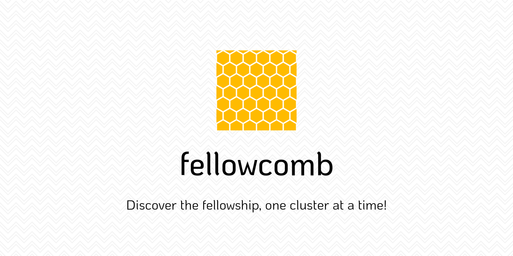

# Fellowcomb 🍯

    

## Inspiration

Fellowcomb draws inspiration from "Honeycomb" Credit Suisse's internal connection tool. Fellowcomb aims to build an exclusive community around MLH Fellows and their interests (termed "clusters"). Most clusters are formed for you through the Discord MLH-Fellowship server, and the rest is up to you. Discover clusters by making meaningful connections with other fellows, and quickly find fellows with similar interests.

## What it does

Fellowcomb connects to your Discord account to gain basic information about you and spins up a user account for you. You are assigned basic clusters as per your pods and roles in MLH. You can then venture out and find other fellows, discover their clusters, and follow/join them if you'd like. A cluster can denote a collection of people with similar roles or interests. An example cluster can be "Pod 1.0.3", where each member in the cluster is a part of this pod. Currently, there's no way of finding all the pod members of a single pod without going through every fellow's roles, and fellowcomb can help with that. JS enthusiasts can join a "JavaScript" cluster, and anyone looking for JS fellows can visit this cluster. Another cluster can be one for "Hiking", where hiking enthusiasts can get acquainted.

Clusters can also be ephemeral, you can have a cluster for people who are up for some video games (eg. Among Us), where people come in and out based on their availability, and people who follow the cluster can at once glance discover all the people available for their next game! Joining a cluster will also give you access to the cluster's private discord channel.

The recent need for free agents could also be easily fulfilled up by fellowcomb, with all free agents in a "Free Agent" cluster.

## How we built it

We used React for the frontend, paired with Chakra-UI. We have an Apollo client for graphql queries, since the backend used Nodejs and Prisma to serve a graphql API.

## Challenges we ran into

1. Integrating OAuth apps is always time consuming, so that's one challenge.
2. We formed our team on Wednesday, so we we're running short on time.

## Accomplishments that we're proud of

1. It works :D
2. Discord is connected, making the sign up process as easy as one click!
3. The fellows now have a place to hang out with other fellow cheese enthusiasts, with no judgment. ;)

## What we learned

Tayeeb and Jainam used graphql for the first time, so that was fun for us. Tayeeb switched to using the React Context API from redux, and had a great time making the switch.

## What's next for fellowcomb

1. Add more attributes to the fellow profile page, like projects, favorite language, timezone, etc.
2. Create private discord channels for clusters on the fellowcomb discord server.

## Contributors

- [@utkarsh867](https://github.com/utkarsh867)
- [@flozender](https://github.com/flozender)
- [@jcs98](https://github.com/jcs98)
